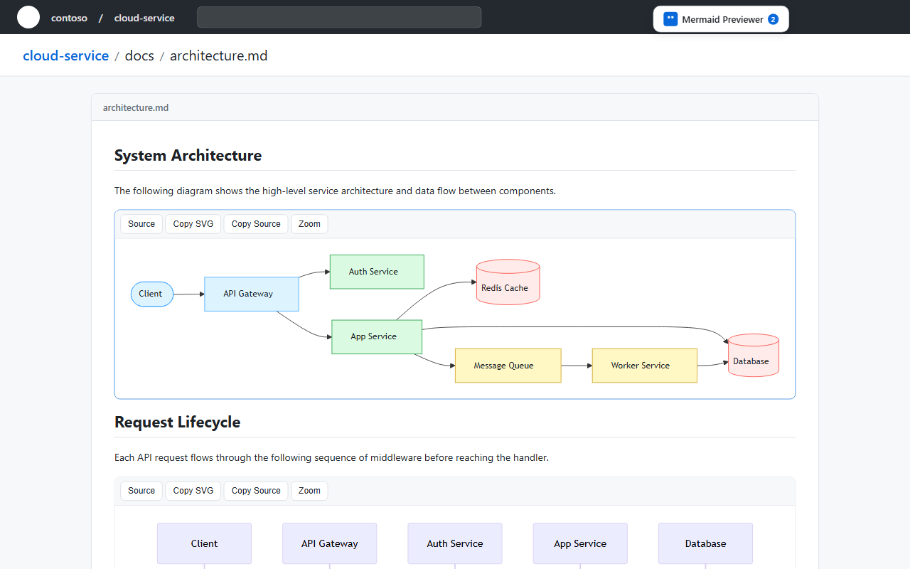
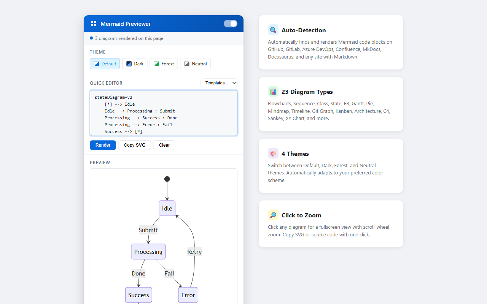
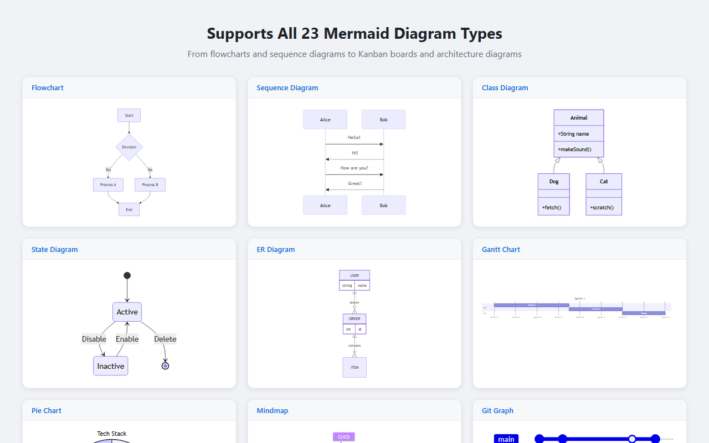

# Mermaid / PlantUML / DOT Diagram Previewer

A Microsoft Edge extension that automatically detects and renders Mermaid, PlantUML, and DOT (Graphviz) code blocks on any web page.



## Features

- **Auto-Detection** — Finds Mermaid, PlantUML (`@startuml`), and DOT (`digraph …`) code blocks on GitHub, GitLab, Azure DevOps, Confluence, Bitbucket, MkDocs, Docusaurus, and any Markdown-based site
- **All 23 Mermaid Diagram Types** — Flowchart, Sequence, Class, State, ER, Gantt, Pie, Mindmap, Timeline, Git Graph, Quadrant, Requirement, C4, Sankey, XY Chart, Block, Packet, Kanban, Architecture, Radar, Treemap, User Journey, ZenUML
- **PlantUML** — Rendered via a configurable server (default `www.plantuml.com`; override in the popup)
- **DOT / Graphviz** — Rendered via a configurable Kroki-compatible server (default `kroki.io`; override in the popup)
- **4 Themes** — Default, Dark, Forest, Neutral
- **Click to Zoom** — Fullscreen overlay with scroll-wheel zoom
- **One-Click Copy** — Copy rendered SVG or source to clipboard
- **Built-in Editor** — Popup editor with live preview and templates for all 23 Mermaid diagram types
- **SPA Support** — Works with single-page apps (GitHub Turbo, GitLab, Azure DevOps) via URL change detection and retry scanning



## Supported Diagram Types



## Install from Source

```bash
git clone <this-repo>
cd MermaidEdgeExtension
npm install
npm run build
```

Then:

1. Open `edge://extensions/`
2. Enable **Developer mode**
3. Click **Load unpacked** and select the generated `dist/` folder

Re-run `npm run build` after pulling changes.

## Project Structure

```
├── manifest.json              # MV3 extension manifest
├── package.json               # npm deps: mermaid
├── scripts/
│   └── build.mjs              # Copies sources + vendor libs into dist/
├── background/
│   └── service-worker.js      # Badge updates, SPA navigation handling
├── content/
│   ├── content.js             # Detection, rendering, observer, zoom
│   └── content.css            # Diagram container, toolbar, overlay styles
├── popup/
│   ├── popup.html             # Extension popup UI
│   ├── popup.js               # Editor, preview, theme switching, templates
│   └── popup.css              # Popup styles
├── lib/
│   └── plantuml-encoder.js    # PlantUML URL encoder (our own, ~55 lines)
├── icons/                     # Extension icons (16/32/48/128px)
└── dist/                      # Build output — load this as unpacked
```

## Enable in InPrivate Mode

1. Go to `edge://extensions/`
2. Find **Mermaid Diagram Previewer** → click **Details**
3. Toggle **Allow in InPrivate** to ON

## License

MIT
